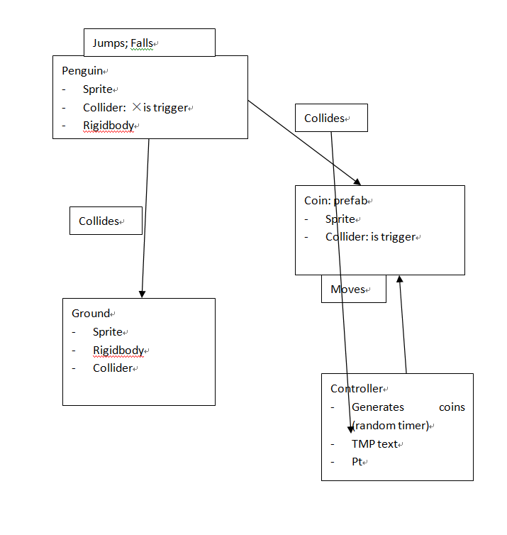
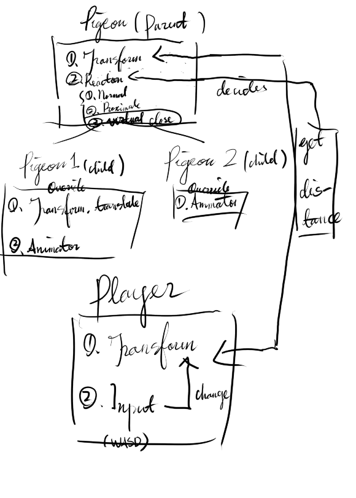
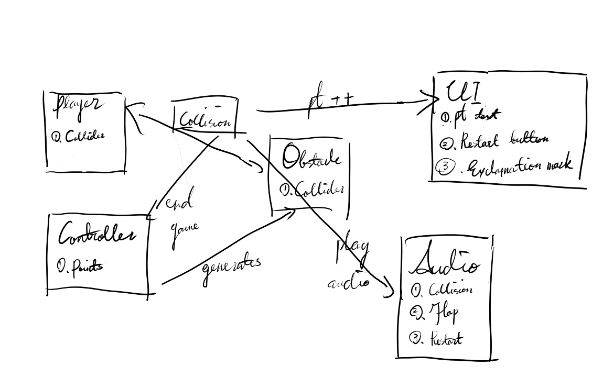
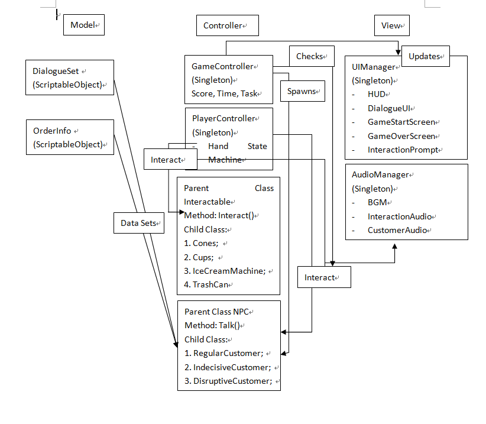

# W1
## Activity 1
- Try to figure out the problems you encounter by yourself first before turning to LA's or generative Ai.
- Read pre-learning slides carefully
- Do not do your homework at the very last day
## Activity 2
1. 10
2. 2
3. The first method calls the second method and the second method prints "hello world" in the log.
4. MonoBehaviour
5. Debug.Log("x = 10");
6. 1. Argument: passing a value to the parameter
    2. Parameter: sth to the output
7. It should be the _playerTransform (the instance) used instead of Transform (the static method)
8. _playerTransform
## Activity 3
- [Allen Gu' s MG1 break-down doc](https://docs.google.com/document/d/1y5LOXHts-EvqE00ku0UjBCC5AgohWl3lteMNVPOctuo/edit?pli=1&tab=t.0)

# W2
## Activity 1

## Activity 2
[Allen Gu' s MG2 Commit](https://github.com/UCI-GDIM32-W25/mg2-Ji-Ying114/commits/main/)
I have completed the whole game.

# W3
## Activity 0-2
Partner name: Yaokun Wan
## Activity 3

1. The finite state machine can posess the pigeons with different status based on the distance between the transform of pigeon and that of the player. The finite state machine contains 3 statuses. 
2. There are two different types of pigeons, having different sprites and reactions when the finite state machine indicates the status of close. There can be a parent class of pigeon and two respective child classes, so that the child classes can inherit some of the methods so that I dont have to write them repatatively, and I can make the code structure more organized. 

# W4
## Activity 1
All the locators are destroyed and only one is left. This is because the code in Awake() destroying the locator if there is already one. 
## Activity 2

## Activity 3
I have completed the whole game.
[Allen Gu' s MG4 Commit](https://github.com/Ji-Ying114/HW4)

# W5
## Activity 1
I think that the interfaces and abstract classes can make the code more maintainable and structured because they are like the frame for certain classes. Once the frame is built, it will be more convinient to build everything else. I think whether changing my codes or not in these projects depends, since some games are not that big and the original frame just works, but principally I think I should change it because it makes the game structure more maintainable so that the further  coding will be much easier. 
## Activity 2
In W5_Demo2, EnemyStats and ItemW5Demo2 are model, EnemyW5Demo2 and PlayerW5Demo2 are controller and DialogueBubble and InventoryUI are view. 
## Activity 3
1. I think that there should be a scriptableobject that stores all the data needed for the beat. There should be multiple child classes inheriting from the parent class but with different input logics. There should be a singleton that tracks the current game status (eg scores)
2. I think that thre should be a scriptableobject that stores the animations and stats, an abstract parent class and multiple interfaces that store modes of attack and movements.
3. I think that there should be an abstract parent class with two child classes which are plant and rock. There should be interfaces, which are destroyable and plantable.There should be a scriptableobject that stores the animations.  
## Activity 4
1. Attendance: Allen Gu, Pengcheng Qi, Haoyi Zhang
2. [Draft Document](https://docs.google.com/document/d/1x9D6Q_2PD2IP5_ACEah36JJO2HM0rF6mYcNEO8_yNTk/edit?tab=t.0)

# W6
## Activity 1
1. The Gizmo tool draws the velosity and the rigidbody of the game objects. It allows me to view the current status of the rigidbody and velocity to check if there are errors without having to click on each object. I think that another important aspect is that I can see the interactions between the objects so that I can view the game and do the debug work more directly. In our project, it is a good tool for adjusting the collision and interaction range so that the game can function properly.
2. The Profiler tool tells me what happens in each frame, including the time that a frame takes, and the processes that affects the game performance. I think that this tool is important for game optimization for especially bigger projects. Our project is a 3D project and there might be a lot of debug logs and processes. So I think that this tool is necessary when the game gets slow and we need to do optimization so that the game can be presented as a well-polished form.
3. The Breakpoint tool can pause the execution of the codes so that we can check what happens when a line of code is executed. I think this is important because when there is a logic error the game will not go as intended but the system will not report anything. At this time, the tool is a useful tool to find out the potential error. The line that does not give the expected output is possibly problemetic. In especially bigger projects like ours, complicated logic bugs are inevitable, and this tool is therefore important. 
## Activity 2
1. Attendance: Allen Gu, Haoyi Zhang, Pengcheng Qi
2. [Draft Document](https://docs.google.com/document/d/1x9D6Q_2PD2IP5_ACEah36JJO2HM0rF6mYcNEO8_yNTk/edit?tab=t.0)

# W7
## Activity 1
1. private Vector3 _raycastStart calculates the srarting point of the raycasting. It switches the object position to the world postion. This is a read-only property that is like a getter. It prevents the data stored in it from being modified.
2. private Vector3 _raycastDir creates a vector pointing to the player character. It is also a property for the same reason. 
3. private void UpdateState () updates the finite state machine by using if() statement and the HasLineOfSightToPlayer() method, which initializes the bool return value to false, projects raycast using Physics.Raycast(), and then checks if the player is in sight by checking the tag.
4. Physics.SphereCast() is used to create a spherecast in HasCloseObstacles () method. This method is used to check if there are close obstacles in the area and return the bool value. If there is, _spherecastHitLocation is modified.
5. OnDrawGizmos() draws the raycast and changes the color according to _hasLineOfSightToPlayer on gizmos; it also draws the area of the spherecast on Gizmos. This is important because it helps the developers see these elements in the scene.
## Activity 2
Attendance: Allen Gu, Haoyi Zhang, Pengcheng Qi
## Activity 3

## Activity 4
[Initial Task](https://trello.com/b/TcDWOqGX)
## Activity 5
DialogueSet script (DialogueSet.cs) added.
3 scriptable objects using DialogueSet.cs added.
[Allen's Commit](https://github.com/leiyu0803/GDIM32-Final/commit/065f2393235d0a78880dd0ea5bf90b971ba4006c)